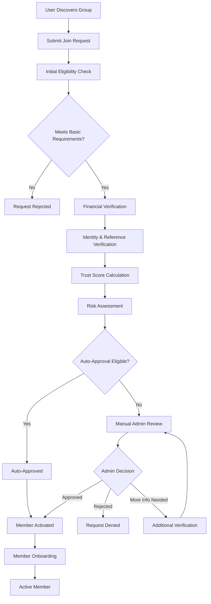

# La Tanda - Comprehensive Member Joining Workflow System Design

## 1. Current Database Analysis

Based on the existing schema analysis, the current `group_members` table has:
- Basic member status tracking (`active`, `inactive`, `removed`, `completed`)
- Member number assignment
- Total contribution tracking
- Joined timestamp

**Gap Analysis:**
- No member request/application process
- No approval workflow
- No trust scoring system
- No financial capacity validation
- No verification steps
- Limited status granularity

## 2. Enhanced Database Schema

### 2.1 New Tables Required

#### A. member_requests (New Table)
```sql
CREATE TABLE member_requests (
    id UUID PRIMARY KEY DEFAULT uuid_generate_v4(),
    group_id UUID NOT NULL REFERENCES groups(id) ON DELETE CASCADE,
    user_id UUID NOT NULL REFERENCES users(id) ON DELETE CASCADE,
    request_status VARCHAR(50) DEFAULT 'pending' CHECK (
        request_status IN ('pending', 'under_review', 'approved', 'rejected', 'withdrawn', 'expired')
    ),
    request_message TEXT,
    requested_at TIMESTAMP WITH TIME ZONE DEFAULT NOW(),
    reviewed_at TIMESTAMP WITH TIME ZONE,
    reviewed_by UUID REFERENCES users(id),
    admin_notes TEXT,
    
    -- Financial Information
    declared_income DECIMAL(12,2),
    income_source VARCHAR(100),
    financial_documents JSONB DEFAULT '[]',
    bank_verification_status VARCHAR(50) DEFAULT 'pending' CHECK (
        bank_verification_status IN ('pending', 'verified', 'failed', 'not_required')
    ),
    
    -- Verification Data
    identity_verified BOOLEAN DEFAULT FALSE,
    phone_verified BOOLEAN DEFAULT FALSE,
    email_verified BOOLEAN DEFAULT FALSE,
    reference_contacts JSONB DEFAULT '[]',
    
    -- Risk Assessment
    risk_score DECIMAL(5,2) DEFAULT 0.00,
    risk_factors JSONB DEFAULT '[]',
    eligibility_score DECIMAL(5,2) DEFAULT 0.00,
    
    -- Tracking
    expires_at TIMESTAMP WITH TIME ZONE,
    auto_expire BOOLEAN DEFAULT TRUE,
    
    UNIQUE(group_id, user_id),
    INDEX idx_member_requests_status (request_status),
    INDEX idx_member_requests_group (group_id),
    INDEX idx_member_requests_user (user_id)
);
```

#### B. user_trust_scores (New Table)
```sql
CREATE TABLE user_trust_scores (
    id UUID PRIMARY KEY DEFAULT uuid_generate_v4(),
    user_id UUID NOT NULL REFERENCES users(id) ON DELETE CASCADE,
    
    -- Core Trust Metrics
    overall_score DECIMAL(5,2) DEFAULT 0.00 CHECK (overall_score >= 0 AND overall_score <= 100),
    payment_reliability DECIMAL(5,2) DEFAULT 0.00,
    group_participation DECIMAL(5,2) DEFAULT 0.00,
    community_standing DECIMAL(5,2) DEFAULT 0.00,
    verification_level_score DECIMAL(5,2) DEFAULT 0.00,
    
    -- Historical Data
    total_groups_completed INTEGER DEFAULT 0,
    total_groups_defaulted INTEGER DEFAULT 0,
    total_amount_contributed DECIMAL(15,2) DEFAULT 0.00,
    average_contribution_timeliness DECIMAL(5,2) DEFAULT 0.00,
    
    -- Behavioral Metrics
    communication_score DECIMAL(5,2) DEFAULT 0.00,
    conflict_resolution_score DECIMAL(5,2) DEFAULT 0.00,
    leadership_score DECIMAL(5,2) DEFAULT 0.00,
    
    -- Reputation
    positive_reviews INTEGER DEFAULT 0,
    negative_reviews INTEGER DEFAULT 0,
    neutral_reviews INTEGER DEFAULT 0,
    endorsements INTEGER DEFAULT 0,
    
    -- System Generated
    calculated_at TIMESTAMP WITH TIME ZONE DEFAULT NOW(),
    last_updated TIMESTAMP WITH TIME ZONE DEFAULT NOW(),
    next_calculation TIMESTAMP WITH TIME ZONE,
    
    -- Metadata
    score_history JSONB DEFAULT '[]',
    calculation_factors JSONB DEFAULT '{}',
    
    UNIQUE(user_id),
    INDEX idx_trust_scores_overall (overall_score),
    INDEX idx_trust_scores_updated (last_updated)
);
```

#### C. member_verifications (New Table)
```sql
CREATE TABLE member_verifications (
    id UUID PRIMARY KEY DEFAULT uuid_generate_v4(),
    request_id UUID NOT NULL REFERENCES member_requests(id) ON DELETE CASCADE,
    user_id UUID NOT NULL REFERENCES users(id) ON DELETE CASCADE,
    
    -- Identity Verification
    identity_document_type VARCHAR(50),
    identity_document_number VARCHAR(100),
    identity_verified_at TIMESTAMP WITH TIME ZONE,
    identity_verified_by VARCHAR(100),
    
    -- Financial Verification
    bank_account_verified BOOLEAN DEFAULT FALSE,
    income_verification_method VARCHAR(50),
    income_verification_status VARCHAR(50) DEFAULT 'pending',
    financial_capacity_score DECIMAL(5,2) DEFAULT 0.00,
    
    -- Address Verification
    address_verified BOOLEAN DEFAULT FALSE,
    address_verification_method VARCHAR(50),
    address_verification_date TIMESTAMP WITH TIME ZONE,
    
    -- References
    reference_verifications JSONB DEFAULT '[]',
    reference_verification_status VARCHAR(50) DEFAULT 'pending',
    
    -- System Verification
    phone_verification_code VARCHAR(10),
    phone_verified_at TIMESTAMP WITH TIME ZONE,
    email_verification_token VARCHAR(255),
    email_verified_at TIMESTAMP WITH TIME ZONE,
    
    -- Risk Assessment
    fraud_check_status VARCHAR(50) DEFAULT 'pending',
    fraud_check_score DECIMAL(5,2) DEFAULT 0.00,
    blacklist_check BOOLEAN DEFAULT FALSE,
    
    -- Tracking
    created_at TIMESTAMP WITH TIME ZONE DEFAULT NOW(),
    completed_at TIMESTAMP WITH TIME ZONE,
    verification_notes TEXT,
    
    INDEX idx_verifications_request (request_id),
    INDEX idx_verifications_user (user_id),
    INDEX idx_verifications_status (income_verification_status)
);
```

#### D. group_member_limits (New Table)
```sql
CREATE TABLE group_member_limits (
    id UUID PRIMARY KEY DEFAULT uuid_generate_v4(),
    group_id UUID NOT NULL REFERENCES groups(id) ON DELETE CASCADE,
    
    -- Membership Rules
    max_members INTEGER NOT NULL,
    current_members INTEGER DEFAULT 0,
    pending_requests INTEGER DEFAULT 0,
    
    -- Eligibility Criteria
    min_trust_score DECIMAL(5,2) DEFAULT 0.00,
    min_income_ratio DECIMAL(5,2) DEFAULT 0.00, -- Minimum income vs contribution ratio
    required_verification_level VARCHAR(50) DEFAULT 'basic',
    
    -- Geographic Restrictions
    location_restrictions JSONB DEFAULT '[]',
    max_distance_km INTEGER,
    
    -- Financial Requirements
    min_financial_capacity DECIMAL(12,2),
    max_debt_to_income_ratio DECIMAL(5,2) DEFAULT 0.40,
    
    -- Experience Requirements
    min_groups_completed INTEGER DEFAULT 0,
    max_default_rate DECIMAL(5,2) DEFAULT 0.10,
    
    -- Approval Settings
    auto_approve_threshold DECIMAL(5,2) DEFAULT 80.00,
    require_admin_approval BOOLEAN DEFAULT TRUE,
    approval_timeout_hours INTEGER DEFAULT 72,
    
    -- Updated tracking
    updated_at TIMESTAMP WITH TIME ZONE DEFAULT NOW(),
    updated_by UUID REFERENCES users(id),
    
    UNIQUE(group_id),
    INDEX idx_group_limits_members (current_members),
    INDEX idx_group_limits_trust (min_trust_score)
);
```

### 2.2 Enhanced group_members Table
```sql
-- Add new status values and fields to existing group_members table
ALTER TABLE group_members 
DROP CONSTRAINT group_members_member_status_check;

ALTER TABLE group_members 
ADD CONSTRAINT group_members_member_status_check 
CHECK (member_status IN ('pending_approval', 'active', 'inactive', 'removed', 'completed', 'suspended', 'probation'));

-- Add new tracking fields
ALTER TABLE group_members 
ADD COLUMN approved_at TIMESTAMP WITH TIME ZONE,
ADD COLUMN approved_by UUID REFERENCES users(id),
ADD COLUMN probation_until TIMESTAMP WITH TIME ZONE,
ADD COLUMN performance_score DECIMAL(5,2) DEFAULT 0.00,
ADD COLUMN violation_count INTEGER DEFAULT 0,
ADD COLUMN last_contribution_date TIMESTAMP WITH TIME ZONE,
ADD COLUMN contribution_streak INTEGER DEFAULT 0,
ADD COLUMN member_notes TEXT;
```

## 3. Member Joining Workflow Design

### 3.1 Workflow Stages



### 3.2 Detailed Stage Definitions

#### Stage 1: Request Submission
- User fills out join request form
- Declares financial information
- Provides initial documentation
- Sets expectations and commitment level

#### Stage 2: Initial Eligibility Check
- Group capacity verification
- Basic user verification status check
- Preliminary financial capacity assessment
- Geographic/location compatibility

#### Stage 3: Financial Verification
- Income verification through bank integration
- Debt-to-income ratio calculation
- Financial stability assessment
- Contribution capacity validation

#### Stage 4: Identity & Reference Verification
- Identity document verification
- Phone and email verification
- Reference contact validation
- Address verification (if required)

#### Stage 5: Trust Score Calculation
- Historical performance analysis
- Community reputation assessment
- Behavioral pattern evaluation
- Risk factor identification

#### Stage 6: Auto-Approval or Manual Review
- Automated decision for high-score applicants
- Manual review for borderline cases
- Admin notification and dashboard update
- Timeline tracking and reminders

## 4. Business Rules & Eligibility Criteria

### 4.1 Basic Eligibility Requirements

```javascript
const ELIGIBILITY_CRITERIA = {
    // User Status Requirements
    accountStatus: ['active'],
    verificationLevel: ['verified', 'premium'],
    kycStatus: ['approved'],
    
    // Trust Score Requirements
    minTrustScore: 25.0, // Out of 100
    maxDefaultRate: 0.15, // 15% maximum default rate
    
    // Financial Requirements
    minIncomeRatio: 2.0, // Income must be 2x contribution amount
    maxDebtToIncomeRatio: 0.40, // 40% maximum debt-to-income
    
    // Experience Requirements
    minGroupsCompleted: 0, // For new users
    maxConcurrentGroups: 5,
    
    // Geographic Requirements
    maxDistanceKm: 50, // 50km radius for local groups
    
    // Verification Requirements
    requiredVerifications: [
        'phone_verified',
        'email_verified',
        'identity_verified'
    ]
};
```

### 4.2 Group-Specific Rules

```javascript
const GROUP_RULES = {
    // High-Value Groups (>$500 contribution)
    highValue: {
        minTrustScore: 70.0,
        minGroupsCompleted: 2,
        maxDefaultRate: 0.05,
        requiredDocuments: ['income_proof', 'bank_statement', 'reference_letters']
    },
    
    // Regular Groups ($100-$500 contribution)
    regular: {
        minTrustScore: 40.0,
        minGroupsCompleted: 0,
        maxDefaultRate: 0.10,
        requiredDocuments: ['income_proof', 'bank_statement']
    },
    
    // Entry-Level Groups (<$100 contribution)
    entryLevel: {
        minTrustScore: 25.0,
        minGroupsCompleted: 0,
        maxDefaultRate: 0.20,
        requiredDocuments: ['income_proof']
    }
};
```

### 4.3 Trust Score Calculation Algorithm

```javascript
const TRUST_SCORE_WEIGHTS = {
    paymentReliability: 0.35,      // 35% - Most important
    groupParticipation: 0.25,      // 25% - Engagement level
    communityStanding: 0.20,       // 20% - Peer reviews
    verificationLevel: 0.15,       // 15% - Document verification
    historicalPerformance: 0.05    // 5% - Long-term track record
};

function calculateTrustScore(userMetrics) {
    const paymentScore = calculatePaymentReliability(userMetrics);
    const participationScore = calculateParticipationScore(userMetrics);
    const communityScore = calculateCommunityStanding(userMetrics);
    const verificationScore = calculateVerificationLevel(userMetrics);
    const historyScore = calculateHistoricalPerformance(userMetrics);
    
    return (
        paymentScore * TRUST_SCORE_WEIGHTS.paymentReliability +
        participationScore * TRUST_SCORE_WEIGHTS.groupParticipation +
        communityScore * TRUST_SCORE_WEIGHTS.communityStanding +
        verificationScore * TRUST_SCORE_WEIGHTS.verificationLevel +
        historyScore * TRUST_SCORE_WEIGHTS.historicalPerformance
    );
}
```

## 5. API Endpoints Design

### 5.1 Member Request Management

```javascript
// POST /api/groups/{groupId}/join-request
// Submit a request to join a group
{
    message: "I would like to join this tanda",
    declaredIncome: 2500.00,
    incomeSource: "salary",
    canCommitToSchedule: true,
    hasReadRules: true,
    emergencyContact: {
        name: "Maria Rodriguez",
        phone: "+504-9999-9999",
        relationship: "sister"
    }
}

// GET /api/member-requests/user/{userId}
// Get all join requests for a user

// GET /api/member-requests/group/{groupId}
// Get all join requests for a group (admin only)

// PUT /api/member-requests/{requestId}/status
// Update request status (admin only)
{
    status: "approved|rejected|under_review",
    adminNotes: "Approved based on excellent trust score",
    conditions: [] // Any special conditions
}

// DELETE /api/member-requests/{requestId}
// Withdraw a join request (user only)
```

### 5.2 Verification Management

```javascript
// POST /api/member-requests/{requestId}/verify-phone
// Verify phone number
{
    phoneNumber: "+504-9999-9999"
}

// POST /api/member-requests/{requestId}/verify-phone/confirm
// Confirm phone verification
{
    verificationCode: "123456"
}

// POST /api/member-requests/{requestId}/upload-documents
// Upload verification documents
{
    documentType: "income_proof|bank_statement|identity_document",
    documentFile: "base64_encoded_file",
    metadata: {
        documentNumber: "0801-1990-12345",
        issueDate: "2023-01-15",
        expiryDate: "2028-01-15"
    }
}

// GET /api/member-requests/{requestId}/verification-status
// Get verification status for a request
```

### 5.3 Trust Score Management

```javascript
// GET /api/users/{userId}/trust-score
// Get user's current trust score

// POST /api/users/{userId}/trust-score/recalculate
// Force recalculation of trust score (admin only)

// GET /api/users/{userId}/trust-score/history
// Get trust score history and trends

// POST /api/users/{userId}/reviews
// Submit a review for a user (group members only)
{
    groupId: "uuid",
    rating: 5,
    categories: {
        communication: 5,
        reliability: 4,
        leadership: 3
    },
    comment: "Excellent group member, always pays on time"
}
```

### 5.4 Group Administration

```javascript
// GET /api/groups/{groupId}/pending-requests
// Get all pending join requests for a group

// POST /api/groups/{groupId}/member-limits
// Set member limits and eligibility criteria
{
    maxMembers: 12,
    minTrustScore: 50.0,
    minIncomeRatio: 2.5,
    autoApproveThreshold: 80.0,
    requiredVerificationLevel: "verified",
    approvalTimeoutHours: 48
}

// GET /api/groups/{groupId}/eligibility-check/{userId}
// Check if a user is eligible to join a group

// POST /api/groups/{groupId}/bulk-approve
// Bulk approve multiple requests
{
    requestIds: ["uuid1", "uuid2", "uuid3"],
    adminNotes: "Approved during weekly review"
}
```

### 5.5 Analytics and Reporting

```javascript
// GET /api/analytics/member-requests/summary
// Get summary statistics for member requests

// GET /api/analytics/trust-scores/distribution
// Get trust score distribution across the platform

// GET /api/analytics/groups/{groupId}/member-performance
// Get member performance analytics for a group

// GET /api/reports/verification-status
// Get verification status report (admin only)
```

## 6. Approval Process for Group Admins

### 6.1 Admin Dashboard Features

```javascript
// Admin Dashboard Components
const ADMIN_DASHBOARD = {
    pendingRequestsWidget: {
        showCount: true,
        showUrgent: true, // Requests near expiry
        quickActions: ['approve', 'reject', 'request_more_info']
    },
    
    eligibilityScoreCard: {
        showTrustScore: true,
        showFinancialCapacity: true,
        showVerificationStatus: true,
        showRiskAssessment: true
    },
    
    memberPerformanceTracker: {
        contributionHistory: true,
        participationMetrics: true,
        conflictHistory: true,
        endorsements: true
    }
};
```

### 6.2 Approval Workflow

```javascript
// Automated Approval Criteria
const AUTO_APPROVAL_CRITERIA = {
    minTrustScore: 80.0,
    allVerificationsComplete: true,
    noRedFlags: true,
    financialCapacityMet: true,
    memberLimitNotExceeded: true
};

// Manual Review Triggers
const MANUAL_REVIEW_TRIGGERS = [
    'trust_score_below_threshold',
    'incomplete_verification',
    'high_risk_factors',
    'group_admin_preference',
    'first_time_user',
    'high_value_group',
    'geographic_exception'
];
```

### 6.3 Admin Notification System

```javascript
// Notification Types
const ADMIN_NOTIFICATIONS = {
    newRequest: {
        priority: 'medium',
        message: 'Nueva solicitud de membresía pendiente',
        actions: ['review', 'defer', 'auto_approve']
    },
    
    urgentReview: {
        priority: 'high',
        message: 'Solicitud requiere revisión inmediata',
        actions: ['review_now', 'escalate']
    },
    
    autoApproved: {
        priority: 'low',
        message: 'Miembro aprobado automáticamente',
        actions: ['view_details', 'override']
    },
    
    verificationRequired: {
        priority: 'medium',
        message: 'Verificación adicional requerida',
        actions: ['review_documents', 'request_more_info']
    }
};
```

## 7. Financial Capacity Validation

### 7.1 Income Verification Methods

```javascript
const INCOME_VERIFICATION = {
    // Bank Integration
    bankConnection: {
        supportedBanks: ['BAC', 'Ficohsa', 'Atlantida', 'Banpais'],
        verificationMethods: ['account_balance', 'transaction_history', 'income_deposits'],
        validationPeriod: '3_months',
        minimumTransactions: 10
    },
    
    // Document Upload
    documentVerification: {
        acceptedDocuments: [
            'salary_certificate',
            'bank_statements',
            'tax_returns',
            'employment_letter',
            'business_income_proof'
        ],
        requiredPeriod: '3_months',
        manualReviewRequired: true
    },
    
    // Third-Party Verification
    thirdPartyServices: {
        creditBureau: true,
        employmentVerification: true,
        incomeEstimation: true
    }
};
```

### 7.2 Financial Capacity Scoring

```javascript
function calculateFinancialCapacity(userFinancials, contributionAmount) {
    const incomeRatio = userFinancials.monthlyIncome / contributionAmount;
    const debtToIncome = userFinancials.monthlyDebt / userFinancials.monthlyIncome;
    const savingsRatio = userFinancials.savings / (contributionAmount * 12);
    const stabilityScore = calculateIncomeStability(userFinancials.incomeHistory);
    
    // Scoring weights
    const weights = {
        incomeRatio: 0.40,      // 40% - Most important
        debtToIncome: 0.25,     // 25% - Debt burden
        savingsRatio: 0.20,     // 20% - Financial cushion
        stabilityScore: 0.15    // 15% - Income stability
    };
    
    // Calculate component scores
    const incomeScore = Math.min(incomeRatio / 3.0, 1.0) * 100; // Target 3x income
    const debtScore = (1 - Math.min(debtToIncome / 0.4, 1.0)) * 100; // Max 40% debt
    const savingsScore = Math.min(savingsRatio / 1.0, 1.0) * 100; // Target 1x savings
    
    return (
        incomeScore * weights.incomeRatio +
        debtScore * weights.debtToIncome +
        savingsScore * weights.savingsRatio +
        stabilityScore * weights.stabilityScore
    );
}
```

## 8. Implementation Timeline & Phases

### Phase 1: Core Infrastructure (Week 1-2)
- Database schema implementation
- Basic API endpoints
- Trust score calculation engine
- Member request workflow

### Phase 2: Verification System (Week 3-4)
- Document upload and verification
- Phone/email verification
- Bank integration setup
- Identity verification

### Phase 3: Admin Dashboard (Week 5-6)
- Admin approval interface
- Notification system
- Analytics dashboard
- Bulk operations

### Phase 4: Advanced Features (Week 7-8)
- Auto-approval system
- Advanced risk assessment
- Performance monitoring
- Mobile app integration

### Phase 5: Testing & Optimization (Week 9-10)
- End-to-end testing
- Performance optimization
- Security audit
- User acceptance testing

## 9. Security Considerations

### 9.1 Data Protection
- Encrypt sensitive financial data
- Secure document storage
- PCI compliance for financial information
- GDPR compliance for user data

### 9.2 Fraud Prevention
- Multi-factor authentication
- Device fingerprinting
- Behavioral analysis
- Blacklist checking
- Identity document verification

### 9.3 Access Control
- Role-based permissions
- API rate limiting
- Audit logging
- Session management
- Secure API authentication

## 10. Success Metrics

### 10.1 Workflow Efficiency
- Average approval time: < 48 hours
- Auto-approval rate: > 60%
- Request completion rate: > 85%
- Admin workload reduction: > 40%

### 10.2 Quality Metrics
- Member default rate: < 5%
- Trust score accuracy: > 90%
- Verification success rate: > 95%
- Member satisfaction: > 4.5/5

### 10.3 System Performance
- API response time: < 500ms
- System uptime: > 99.9%
- Document processing time: < 24 hours
- Notification delivery: < 5 minutes

This comprehensive design provides a robust, scalable, and secure member joining workflow system that addresses all the key requirements for La Tanda's rotating savings groups platform.